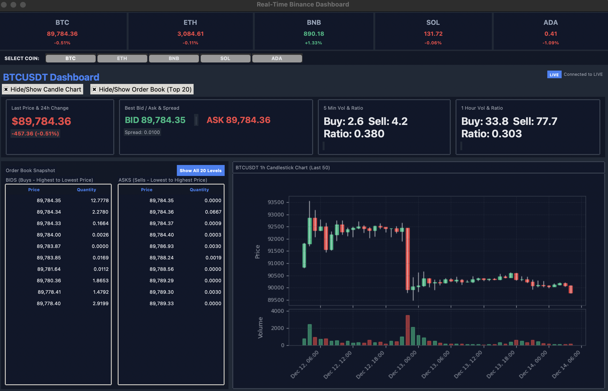

# Real-Time Binance Dashboard

##  Project Overview
This project is a high-performance desktop application developed using **Python** and **Tkinter**. Its primary purpose is to provide users with a **real-time** monitoring and analysis platform for the cryptocurrency market data, specifically pulling live information from the **Binance API** via **WebSocket Streams**.

The dashboard uses a robust **Multi-threading** architecture to handle multiple data streams concurrently, ensuring the GUI remains responsive and provides a smooth, professional user experience, thereby achieving all the project's learning objectives (OOP, Event-Driven, Multi-threading, and API integration).

##  Features

### Real-Time Data Handling & Tickers
* **Thread-Safe UI:** Data updates from background WebSocket threads are safely handled on the main GUI 
thread using **`root.after(0, ...)`** callbacks, preventing the application from freezing.
* **Live Stats:** Displays real-time price, 24-hour volume, change percentage, Bid/Ask spread, and high/low metrics via the Binance `@bookTicker` stream.
* **Visual Feedback:** Features color-coded indicators (Green for positive change, Red for negative) and uses the **`root.after(0, ...)`** mechanism for **Thread-Safe UI** updates, preventing the GUI from freezing.

### Order Book Visualization
* **Live Market Depth:** Displays the Bid/Ask order book using a `Treeview` widget, updated continuously via the dedicated depth WebSocket stream (`@depth@100ms`).
* **Configurable Depth:** Includes a button to toggle between the default order book depth and maximum depth levels (e.g., 100 Levels) for comprehensive market view.
* **Color Coding:** Buy (Bid) and Sell (Ask) orders are color-coded (Green/Red) for quick identification.

### Candlestick Charts & Analysis
* **Live K-Line Chart:** Displays Candlestick charts (fixed at 1-hour interval) using **Matplotlib** integrated into Tkinter. The last candle is updated in real-time via the `@kline` WebSocket stream.
* **Robust Data Fetching:** Historical K-line data is fetched reliably from the Binance REST API, utilizing a custom function with explicit **Retry Logic** to handle network errors.

## Technology Stack

* **Python**: Core programming language
* **Tkinter**: GUI framework for desktop application
* **Matplotlib**: Chart visualization and rendering
* **WebSocket**: Real-time data streaming (`websocket-client`)
* **Binance API**: Market data source (REST & WS)
* **Threading**: Concurrent data processing to manage multiple streams without blocking the GUI

### Install Required Dependencies
```bash
pip install -r requirements.txt

Or install manually:

Bash
pip install websocket-client requests numpy matplotlib
```

## Project Structure

crypto_dashboard/
├── main.py                 # Entry point
├── components/
│   ├── __init__.py
│   ├── ticker.py          # CryptoTicker class
│   ├── orderbook.py       # OrderBookPanel class
│   ├── technical.py       # TechnicalAnalysisPanel class
│   └── futures.py         # FuturesPanel class
├── utils/
│   ├── __init__.py
│   ├── binance_api.py     # API helper functions
│   └── indicators.py      # Technical analysis calculations
├── config.py              # Configuration (symbols, colors, etc.)
└── requirements.txt       # Dependencies

## Interface Controls
# Default View:
- The dashboard initializes with a default primary symbol (e.g., BTCUSDT) set as the focus.
- Core data panels (Last Price, Bid/Ask Spread, Vol/Ratio) are visible initially.

# Symbol Switching (Changing Primary Asset):
- Click any currency button in the header bar (e.g., BTC, ETH, BNB, SOL, ADA) under the SELECT COIN: prompt.
- This action immediately stops the previous WebSocket streams and starts a new set of streams for the selected symbol across the entire dashboard.

# Toggle Panel Visibility:
- Candle Chart: Use the Hide/Show Candle Chart checkbox to collapse or expand the K-Line Candlestick Chart and its associated Volume panel.
- Order Book: Use the Hide/Show Order Book (Top 20) checkbox to collapse or expand the Order Book Snapshot panel.

# Data Depth Control:
- Inside the Order Book panel, click the Show All 20 Levels button to toggle the display from the default limited view to the maximum available depth.

## Final Output Screenshot
